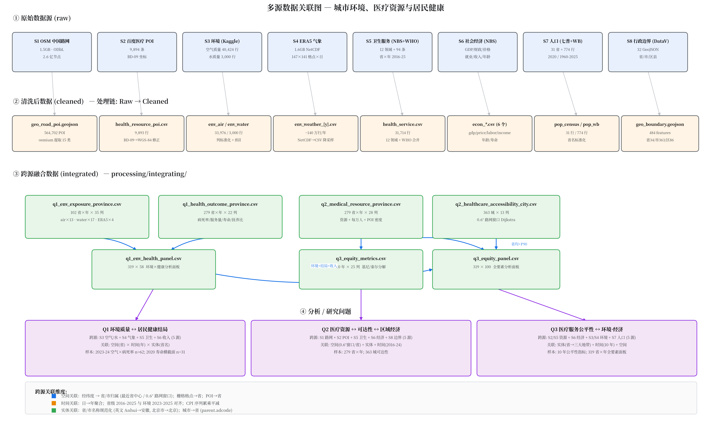

# 数据源清单

> 项目：城市环境、医疗资源与居民健康 — 多源数据融合分析

---

## 数据源总览

| # | 数据源名称 | 领域 | 获取方式 | 数据类型 | 大小 | 时间范围 | 许可/使用说明 | 跨源关联字段 |
|---|-----------|------|---------|---------|-----------|---------|-------------|------------|
| S1 | OpenStreetMap 中国路网 | 路网/POI | 公开下载 (Geofabrik) | 地理空间矢量 | 1.5GB | 持续更新 | ODbL | 经纬度, 行政区划 |
| S2 | 百度地图医疗机构 POI | 医疗资源 | 公开 API | 结构化数据 | 1.7MB | 采集时快照 | 仅供学术研究 | 城市, 经纬度, 区县 |
| S3 | Kaggle 环境数据（空气质量+水质量） | 环境 | 公开数据集下载 | 结构化数据 | 13MB | 2023-2026 | 公开数据集 | 城市/省份, 经纬度, 日期 |
| S4 | ERA5 再分析气象数据 | 气象 | CDS API | 科研栅格 | 1.6GB | 2023-2025 | Copernicus 免费 | 经纬度, 时间 |
| S5 | 健康与医疗服务数据（国家数据平台+WHO+COVID） | 健康 | API + 公开数据集 | 统计数据 | 74MB | 2016-2025 | 公开数据 / CC BY 4.0 | 省份/国家, adcode, 年份 |
| S6 | 国家数据平台省级经济指标 | 社会经济 | stream/esData API | 统计数据 | 11.2MB | 2006-2025 | 公开数据 | 省份, adcode, 年份 |
| S7 | 人口数据（七普+World Bank） | 人口 | 公报编译 + REST API | 政府公报/统计数据 | 39KB | 1960-2025 | 公开数据 / CC BY 4.0 | 省份/国家, adcode, 年份 |
| S8 | DataV 行政区划边界 | 空间底座 | 公开 API 下载 | 地理空间矢量 | 4.6MB | — | 公开数据 | adcode, 行政区划名称 |

---

## 各数据源详情

### S1. OpenStreetMap 中国路网

**元数据描述**

| 属性 | 内容 |
|------|------|
| 来源 | https://download.geofabrik.de/asia/china.html |
| 采集脚本 | `crawler/fetch_geo_road.py` |
| 保存位置 | `data/raw/geo_road/china-latest.pbf` |
| 大小 | 1.5GB（.osm.pbf） |
| 时间范围 | 持续更新（2026-09-20 下载快照） |
| 许可 | Open Database License (ODbL) |
| 关键字段 | 节点(nodes)、边(ways)、标签(tags)——清洗阶段用 osmium 提取医疗/教育/交通 POI |
| 跨源关联字段 | 经纬度, 行政区划标签 |

**样本展示**

```
PBF 二进制格式（无文本样例）。标准化结构示意：
node(id=123456, lat=39.9042, lon=116.4074, tags=[amenity=hospital, name=北京医院])
way(id=789, nodes=[...], tags=[highway=primary, name=长安街])
```

### S2. 百度地图医疗机构 POI

**元数据描述**

| 属性 | 内容 |
|------|------|
| 来源 | https://api.map.baidu.com/place/v2/search |
| 采集脚本 | `crawler/fetch_health_resource.py` |
| 保存位置 | `data/raw/health_resource/medical_poi.csv` |
| 大小 | 1.4MB，8,005 条（31 个省会/直辖市） |
| 查询分类 | 医院、诊所、卫生所、卫生院、社区卫生服务中心、妇幼保健、中医院、体检中心、药店（9 类） |
| 许可 | 仅供学术研究（百度地图开放平台） |
| 关键字段 | id, name, address, city, district, telephone, longitude, latitude, tag, search_query |
| 坐标系 | BD-09（清洗阶段转换为 WGS-84） |
| 跨源关联字段 | 城市名→省份, 经纬度, 区县 |
| 局限 | 仅覆盖省会城市市区，非全国县级覆盖 |

**样本展示**

```csv
id,name,address,city,district,telephone,longitude,latitude,tag,search_query
e6ee2fd2e55bef512b11d1c8,首都医科大学附属北京友谊医院(西城院区),北京市西城区永安路95号,北京市,西城区,(010)63138585,116.39852,39.891551,1.0,医院
```

### S3. 环境数据（空气质量 + 水质量，Kaggle）

#### S3a. 空气质量+气象逐日数据

**元数据描述**

| 属性 | 内容 |
|------|------|
| 来源 | https://www.kaggle.com/datasets/houjihao/china-capitals-weather-and-air-quality-2023-2026 |
| 采集脚本 | `crawler/fetch_env_air.py` |
| 保存位置 | `data/raw/env_air/china_air_quality_daily.csv` |
| 大小 | 12.7MB，40,424 行 × 20 列（31 个省会/直辖市，逐日） |
| 许可 | 公开 Kaggle 数据集（附 LICENSE_NOTICE.md） |
| 关键字段 | date, city_name, latitude, longitude, temperature_2m_mean_c, precipitation_sum_mm, pm2_5_mean_ug_m3, pm10_mean_ug_m3, nitrogen_dioxide_mean_ug_m3, ozone_mean_ug_m3, us_aqi_daily_max, european_aqi_daily_max |
| 跨源关联字段 | 城市名（英文，经 utils.py 英文映射→省份）、经纬度、日期 |

**样本展示**

```csv
date,city_name,province_level_region,city_type,latitude,longitude,temperature_2m_mean_c,precipitation_sum_mm,pm2_5_mean_ug_m3,pm10_mean_ug_m3,us_aqi_daily_max,european_aqi_daily_max
2023-01-01,Beijing,Beijing,Municipality,39.9042,116.4074,-2.4,0.0,79.871,119.171,166,102
```

#### S3b. 水质量监测数据

**元数据描述**

| 属性 | 内容 |
|------|------|
| 来源 | https://www.kaggle.com/datasets/khushikyad001/china-water-pollution-monitoring-dataset |
| 采集脚本 | `crawler/fetch_env_water.py` |
| 保存位置 | `data/raw/env_water/china_water_pollution_data.csv` |
| 大小 | 0.5MB，3,000 行 × 25 列 |
| 许可 | 公开 Kaggle 数据集 |
| 关键字段 | Province, City, Monitoring_Station, Latitude, Longitude, Date, pH, Dissolved_Oxygen_mg_L, Nitrate_mg_L, Ammonia_N_mg_L, Total_Phosphorus_mg_L, COD_mg_L, Heavy_Metals_Pb/Cd/Hg_ug_L, Water_Quality_Index, Pollution_Level |
| 跨源关联字段 | 省份, 城市, 经纬度, 日期 |

**样本展示**

```csv
Province,City,Monitoring_Station,Latitude,Longitude,Date,pH,Dissolved_Oxygen_mg_L,Ammonia_N_mg_L,Total_Phosphorus_mg_L,COD_mg_L,Water_Quality_Index,Pollution_Level
Sichuan,Mianyang,Mianyang_Station_1,32.243099,112.88876,2023-03-05,6.89,8.14,0.38,0.147,16.82,66.25,Excellent
```

### S4. ERA5 再分析气象数据

**元数据描述**

| 属性 | 内容 |
|------|------|
| 来源 | https://cds.climate.copernicus.eu |
| 数据集 | reanalysis-era5-single-levels |
| 采集脚本 | `crawler/fetch_env_weather.py` |
| 保存位置 | `data/raw/env_weather/era5_single_level_{2023,2024,2025}.nc` |
| 大小 | 1.6GB（3 个年度 NetCDF） |
| 时间范围 | 2023-2025（2023 年部分下载失败，保留 2024-2025 完整数据） |
| 变量 | 2m温度、2m露点温度、10m风速 U/V 分量、地表气压 |
| 区域 | 中国 [55°N, 70°E, 20°N, 140°E]，每日 4 时次（00/06/12/18 UTC） |
| 许可 | Copernicus 免费，需接受使用条款（需 ~/.cdsapirc） |
| 跨源关联字段 | 经纬度, 时间 |

**样本展示**

```
NetCDF 栅格结构（示意）：
dims: time=1460, latitude=141, longitude=281
variables: t2m(time,lat,lon) [K], d2m, u10, v10, sp
示例: t2m[2024-06-01 00UTC, 39.75N, 116.25E] = 295.6 K → 22.4°C
```

### S5. 健康与医疗服务数据（国家数据平台 + WHO + COVID）

#### S5a. 国家数据平台省级卫生指标

**元数据描述**

| 属性 | 内容 |
|------|------|
| 来源 | https://data.stats.gov.cn/（分省年度数据） |
| API端点 | `https://data.stats.gov.cn/dg/website/publicrelease/web/external/stream/esData` |
| 采集脚本 | `crawler/fetch_health_service.py` |
| 保存位置 | `data/raw/health_service/nbs_health_*.csv`（12 个领域文件） |
| 大小 | 12 个领域共 ~31,000 行，31 省 × 2016-2025 |
| 领域清单 | 医疗卫生机构、医疗卫生机构床位、卫生人员、每万人口卫生技术人员数、每万人口医疗卫生机构床位数、门诊服务、住院服务、乡镇卫生院医疗服务、村卫生室、社区卫生服务中心（按床位分组）、医院床位利用、新型农村合作医疗 |
| 许可 | 公开政府数据 |
| 关键字段 | province, adcode, year, indicator, value |
| 跨源关联字段 | 省份, adcode, 年份 |

**样本展示**

```csv
province,adcode,year,indicator,value
北京,110000000000,2025,卫生技术人员数 (万人),
```

#### S5b. WHO GHO 全球健康指标

**元数据描述**

| 属性 | 内容 |
|------|------|
| 来源 | https://www.who.int/data/gho |
| API端点 | `https://ghoapi.azureedge.net/api/` |
| 采集脚本 | `crawler/fetch_health_service.py` |
| 保存位置 | `data/raw/health_service/who_gho_china_health.csv` |
| 大小 | 94 条（13 个指标，2020-2025，中国） |
| 许可 | CC BY 4.0 |
| 关键指标 | 预期寿命、HALE、5 岁以下死亡率、孕产妇死亡率、粗出生/死亡率、肥胖率、结核发病率、人均卫生支出、每万人医生/床位数 |
| 局限 | 仅国家级数据，无省级数据 |
| 跨源关联字段 | 国家 (CHN), 年份 |

**样本展示**

```csv
indicator_id,indicator_name,year,value,sex
WHOSIS_000001,life_expectancy_at_birth,2020,77.48113543,SEX_BTSX
```

#### S5c. COVID-19 全球疫情数据

**元数据描述**

| 属性 | 内容 |
|------|------|
| 采集脚本 | 手动下载 |
| 保存位置 | `data/raw/health_service/covid/covid-19-all.csv` |
| 大小 | 1,241,952 行（全球逐日累计确诊/治愈/死亡） |
| 关键字段 | Country/Region, Province/State, Latitude, Longitude, Confirmed, Recovered, Deaths, Date |
| 跨源关联字段 | 国家/地区, 经纬度, 日期 |

**样本展示**

```csv
Country/Region,Province/State,Latitude,Longitude,Confirmed,Recovered,Deaths,Date
,,,,58316.0,33634.0,1181.0,2021-01-01
```

### S6. 国家数据平台省级经济指标

**元数据描述**

| 属性 | 内容 |
|------|------|
| 来源 | https://data.stats.gov.cn/ |
| 采集脚本 | `crawler/fetch_econ.py` |
| 保存位置 | `data/raw/econ_gdp/nbs_econ_gdp.csv`（GDP与经济增长）、`data/raw/econ_gdp/nbs_econ_finance.csv`（地方财政）、`data/raw/econ_price/nbs_econ_price.csv`（价格指数）、`data/raw/econ_labor/nbs_econ_labor.csv`（就业与工资）、`data/raw/econ_income/nbs_econ_income.csv`（居民人均可支配收入）、`data/raw/pop_age/nbs_pop_age_structure.csv`（年龄构成与抚养比）、`data/raw/pop_life_exp/nbs_life_expectancy.csv`（平均预期寿命） |
| 大小 | 共 ~11MB，约 132,500 行（31 省 × 2006-2025，因领域而异） |
| 领域清单 | GDP与经济增长（18 指标，2016-2025）、地方财政（2016-2025）、价格指数（326 指标，2006-2025）、就业与工资（36 指标，2011-2025）、居民收入（全体/城镇/农村，2016-2025）、人口年龄构成与抚养比（65岁及以上人口、抚养比，抽样调查年 2016-2024）、平均预期寿命（总/男/女，2020） |
| 许可 | 公开政府数据 |
| 关键字段 | province, adcode, year, indicator, value |
| 跨源关联字段 | 省份, adcode, 年份 |

**样本展示**

```csv
province,adcode,year,indicator,value
北京,110000000000,2025,第一产业增加值 (亿元),109.2
北京,110000000000,2025,地区生产总值 (亿元),52073.4
北京,110000000000,2025,地方财政一般公共预算收入(亿元),6680.56
北京,110000000000,2025,居民消费价格指数 (上年=100),99.9
北京,110000000000,2025,城镇单位就业人员 (万人),
北京,110000000000,2025,全体居民人均可支配收入 (元),89090
北京,110000000000,2024,65岁及以上人口数 (人口抽样调查) (人),13399
北京,110000000000,2020,平均预期寿命 (岁),
```

### S7. 人口数据（七普 + World Bank）

#### S7a. 第七次全国人口普查

**元数据描述**

| 属性 | 内容 |
|------|------|
| 来源 | https://www.stats.gov.cn/sj/tjgb/rkpcgb/（第七次普查公报） |
| 采集脚本 | `crawler/fetch_pop.py`（公报数据编译） |
| 保存位置 | `data/raw/pop_census/census_7_province_population.csv` |
| 大小 | 2KB，31 省常住人口（万人 + 人），2020 年 |
| 许可 | 公开数据 |
| 关键字段 | province, adcode, population_wan, population, year |
| 跨源关联字段 | 省份, adcode |

**样本展示**

```csv
province,adcode,population_wan,population,year,source
山东,370000,10153,101530000,2020,第七次全国人口普查
```

#### S7b. World Bank 中国指标

**元数据描述**

| 属性 | 内容 |
|------|------|
| 来源 | https://api.worldbank.org/v2/country/CHN/indicator/ |
| 采集脚本 | `crawler/fetch_pop.py` (fetch_worldbank) |
| 保存位置 | `data/raw/pop_wb/worldbank_population_china.csv`、`world_bank_health_social.csv`、`world_bank_supplement.csv` |
| 大小 | 36KB，2,325 行（15+ 指标，1960-2025） |
| 关键指标 | 总人口、城镇化率、预期寿命、出生/死亡率、婴儿死亡率、人均 GDP、卫生支出占 GDP、每千人医生/床位数、基尼系数、贫困率 |
| 许可 | CC BY 4.0 |
| 跨源关联字段 | 国家, 年份 |

**样本展示**

```csv
indicator_code,indicator_name,year,value
SP.POP.TOTL,total_population,2024,1408975000.0
```

### S8. 行政区划边界矢量数据

**元数据描述**

| 属性 | 内容 |
|------|------|
| 来源 | https://geo.datav.aliyun.com/areas_v3/bound/ |
| 采集脚本 | `crawler/fetch_geo_boundary.py` |
| 保存位置 | `data/raw/geo_boundary/`（`{adcode}_{name}.json` × 31 + `100000_china.json`） |
| 大小 | 4.6MB（32 个 GeoJSON 文件） |
| 数据格式 | GeoJSON |
| 关键内容 | 省级边界（31 个，含市级行政区）、全国边界（1 个） |
| 许可 | 公开数据 |
| 跨源关联字段 | adcode, 行政区划名称 |

**样本展示**

```json
{"type": "Feature", "properties": {"adcode": 110101, "name": "东城区", "center": [116.418757, 39.917544], "centroid": [116.416718, 39.912934]}}
```

---

## 跨源关联方式

| 关联维度 | 涉及数据源 | 关联键 |
|---------|-----------|--------|
| 空间关联 | S1+S2+S3+S4+S5c+S8 | 经纬度 → 行政区划 (Point-in-Polygon)，或城市名→省份映射 |
| 时间关联 | S3+S4+S5+S6+S7 | 年份/日期（省级统一 2016-2025，环境 2023-2025） |
| 实体关联 | 所有源 | 省份/城市名称（中英文映射，见 `processing/cleaning/utils.py`） |

关联层级说明：省级融合（S5a+S6+S7+S8）覆盖 31 省完整；城市级融合（S2+S3a+S8）覆盖 31 个省会城市；S5b/S7b 为国家级对照。


